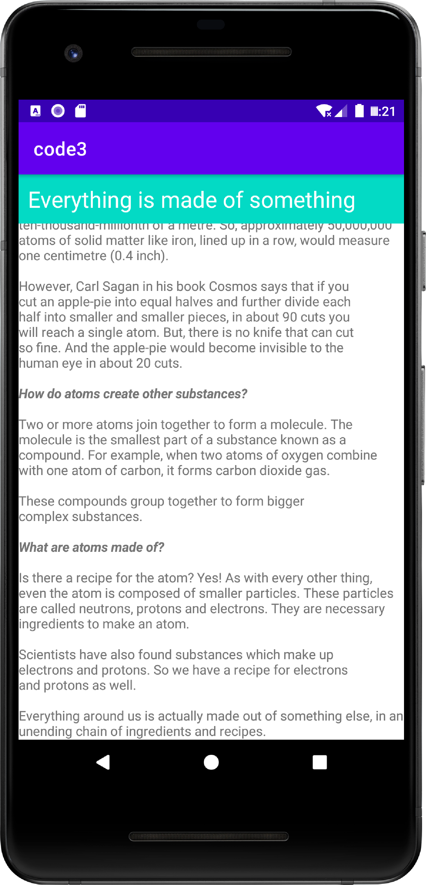

# 参考

https://xxgqin.gitbook.io/android/ch01/ch01-3

# 效果

# 实验目的

掌握Android Studio集成开发环境的基本用法；

- 了解Android工程基本结构；
- 了解Activity的创建及布局资源的基本使用；
- 了解Activity生命周期及其不同状态；

# 实验小结

通过本次实验，你应该掌握了如下知识内容：

- 使用RelativeLayout（相对布局）进行布局管理；
- 使用ScrollView进行布局管理；
- 使用TextView进行长文本显示及格式设置；